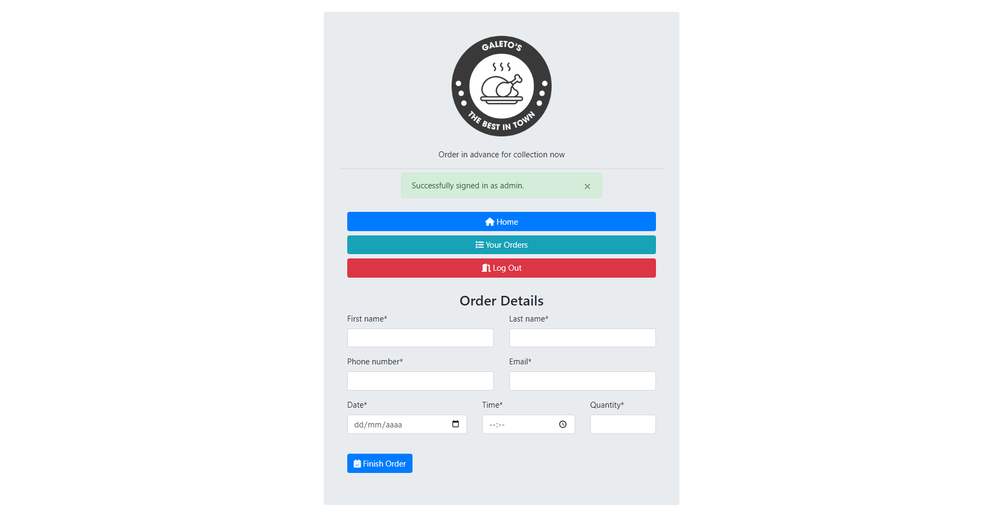
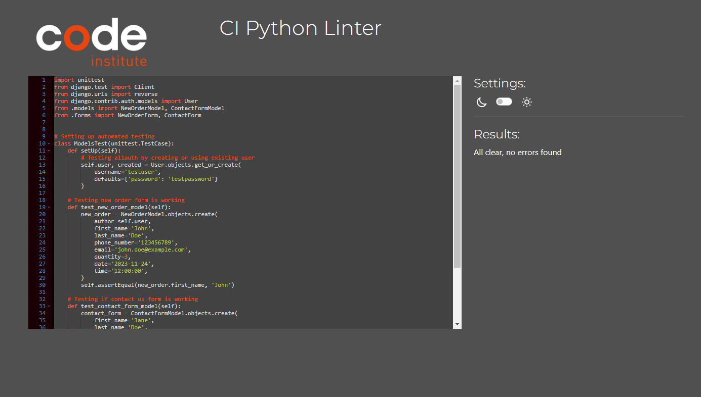

<h1 align="center"><a href="https://galetos-orderapp-pp4-1411404b0904.herokuapp.com/" target="_blank">Galeto's</a></h1> 

Galeto's a Django/Python developed order app that was desinged for a friend of mine who sells roasted chicken and needed some sort of simple looking ordering/booking systems for their clients to be able to order in advance their roasted chicken, and collect best time suited. The app meets all the needs of their business and help them to organise better their future sales and avoid waste.

[**Link to Galeto's App Live **](https://galetos-orderapp-pp4-1411404b0904.herokuapp.com/)

# Contents

- [Contents](#contents)
  - [User Experience (UX)](#user-experience-ux)
    - [User Stories](#user-stories)
  - [Features](#features)
    - [Landing Page](#landing-page)
    - [Contact Us](#contact-us)
    - [About Us](#about-us)
    - [Log In](#log-in)
    - [Sign Up](#sign-up)
    - [Menu](#menu)
    - [New Order Form](#new-order-form)
    - [Calendar](#calendar)
    - [Time Selection](#time-selection)
    - [Quantity Selection](#quantity-selection)
    - [Orders list](#orders-list)
    - [Edit Order](#edit-order)
    - [Django Admin Panel](#django-admin-panel)
    - [Approve Orders](#approve-orders)
    - [Order Details](#order-details)
    - [Admin Filters](#admin-filters)
    - [Messages](#messages)
    - [Future Features](#future-features)
  - [Testing](#testing)
    - [Bugs and Issues](#bugs-and-issues)
  - [Technologies Used](#technologies-used)
  - [Deployment](#deployment)
  - [Credits](#credits)
    - [Content](#content)
    - [Media](#media)
  - [Acknowledgments](#acknowledgments)
- [THANK YOU!](#thank-you)

___

## User Experience (UX)

  ### User Stories

     i.   As a Site User I can register an account so that create, read, update and delete orders
     ii.  As a site user I can create orders on database so that have a order created
     iii. As a Site user I can view the orders I created so that manage the orders
     iv.  As a site user I can edit my orders so that modify the details of the orders
     v. As a site user I can delete my orders so that manage the orders
     vi. As a site user I can see about us page so that check opening ours and address for collection
     vii. As a site I can see the contact details and form so that get in touch with the retail if needed

  [Back to top](<#contents>)
  
   - ### Agile and Kanban
    GitHub Project Boards and Kanban are instrumental in collaborative project management. Using Kanban methodology, tasks move through stages like "To do," "In progress," "Testing," and "Done," providing a visual representation and limiting work in progress.

    

[Back to top](<#contents>)

  - ### FlowChart
    The flowchart was a very useful tool to plan ahead and understand how to build the application below you can see the chart that was made using the [**Lucid**](https://lucid.co/)

    

[Back to top](<#contents>)

  - ### Design Choices
      The idea was to build a a simple "app-based" design with smooth transitions to make the UX even more seamless and intuitive. All the colors and styles were applied with the built in classes provided that can be found on the [**Bootstrap**](https://getbootstrap.com/) documentation.

[Back to top](<#contents>)

## Features

  ### Landing Page
Landing page was design to look like a simple booking app "menu-based" where the user can easily find and reach what their need with no distractions or missleading information. Ofering 3 simple options as: new order, contact us or about us.

   

[Back to top](<#contents>)

  ### Contact Us
Contact us page has a simple form that can be filled intuitively by the user

   
  
[Back to top](<#contents>)
        
  ### About Us
About us page contains the working hours and address with a google maps API for easily directions for the user

   

[Back to top](<#contents>)

  ### Log In
Once the user choose the options new order he will be redirect to a login page that has instructions if the user does not have an account yet

   
 
[Back to top](<#contents>)

  ### Sign Up
If the user does not have an account already he will be asked to click the link in the log in page and follow the instructions to create a new account

   
 
[Back to top](<#contents>)

  ### Menu
A menu is introduced to the user once loged in with three basic options: Home, Orders List and Log out.

   
 
[Back to top](<#contents>)

  ### New Order Form
Once loged in the user will be redirected to the new order form that can be easily filled and completed.

   
 
[Back to top](<#contents>)

  ### Calendar
Whent he calendar is selected the built-in django widget pops to help user select best day suited.

   
 
[Back to top](<#contents>)

  ### Time Selection
time selection render django widget as well to better UX design.

  
   
[Back to top](<#contents>)

  ### Quantity Selection
Quantity selection could be typed in or selected by the picker

  

[Back to top](<#contents>)

  ### Orders list
Once the order is finished user will be redirected to orders list where the user could easily place another order, edit or delete the existing ones. It was designed toeb be simple and  intuitive.

  

 
[Back to top](<#contents>)

  ### Edit Order
If the user choose to edit and existing order the app will be redirect the the order form page but retrieving the data from database for editing.

  

[Back to top](<#contents>)

  ### Django Admin Panel
The built in Django Admin panel was setted up to help the admin to manage the orders as well as reading the messages from costumers

  

[Back to top](<#contents>)

  ### Approve Orders
All new orders are set to be Pendind an  get easily be approved by the admin panel

  

[Back to top](<#contents>)

  ### Order Details
Admin can have access to the order details through the admin panel.

  

[Back to top](<#contents>)

  ### Admin Filters
Admin have some filters feature to help locate orders such as pending orders, or approved ones and so on.

  

[Back to top](<#contents>)

  ### Messages
Messages sent through the contact us page can be easily found on the admin panel as well as the message details.

  

  

[Back to top](<#contents>)

  ### Future Features
For future features I will definetly implement and disable past dates and out of work hours that I could not implement due the deadline. Also I would do some more UX design when delete or editing and a modal popup that gets a validation from user of their choice. Also a banner when order is created, updated or deleted to give user more assurance of their action. I would also implement and API system that could send a email confirmation to the user and the administrator thar a new order was created 

[Back to top](<#contents>)

## Testing

| Test                | Action                   | Success Criteria  |
  | -------------       |-------------             | -----|
  | Landingpage loads      | Navigate to website URL  | Page loads < 5s, no errors |
  | Links            | Click on each Navigation link  | Correct section is redirected action performed |
  | Athentications System  | User should be able Sign Up Log In and Log Out | All functions working fine as expected |
  | CRUD Functionality  | User should be able to create edit and delete orders | All functions working fine as expected |
  | Responsiveness | Resize the viewport window from 320px upwards with Chrome Dev Tools. Use Responsive Design Checker to test various mobile, tablet, and large screen sizes | Page layout remains intact and adapts to screen size|
  | Different web browsers | Runned the app in Google Chrome, Mozilla Firefox and Internet Explorer | App works responsive and layout remains intact no errors or bug detected |
  | Different screen devices | Runned the app using a Samsung Galaxy s20 and Iphone 13 | App works responsive and layout remains intact no errors or bug detected |

[Back to top](<#contents>)

HTML validator

PEP8 validator

Over all Google Chrome LightHouse Report

Automated testing with built in Django unittest

[Back to top](<#contents>)

 ### Bugs and Issues

Debugging and troubleshooting were done constantly throughout development.

[Back to top](<#contents>)

___

## Technologies Used
I used the following technologies, platforms and support in building my project:
- The application was built in Python.
- The [**Code Institute**](https://codeinstitute.net/) modules/lessons aided my learning and many of the concepts learned were applied in this project.
- [**GitHub**](https://github.com/Cesargarciajr/bloom-of-life) was used for the project repository.
- [**Code Anywhere**](https://app.codeanywhere.com/) - for IDE and editor of the code.
- [**Django**](https://www.djangoproject.com/) - framework to develop the app and a few other libraries such as athentications system "Allauth" all specified in the requirements.txt file
- [**Bootstrap**](https://getbootstrap.com/) - for design and choices.
- [**Heroku**](https://www.heroku.com/platform) - was used for application deployment.
- [**Elephant SQL**](https://www.elephantsql.com/) - for database.
- [**PEP8CI Validator**](https://app.codeanywhere.com/) - for error and issues with the code
- [**Lucid**](https://lucid.co/) - Flowchart used on readme file.

[Back to top](<#contents>)

## Deployment

GitHub Deployment

First of all you need to have a GitHub account and I choose it because it's free and easy to create a repository to host your code and share with others.

- To create a repository you just need to go to the main page at the top right you will see a "+" button just click here and then new repository

- Select the name of the project and a description make it public and then create a repository

- Once you created your repository go the settings section and then click on pages

- Select the Branch as main and then save it.

- Finally, your repository is deployed and it should show you a link so you can share it with others.

Cloning the Repo

1. Click on the "Code" button near the top right corner of the page.
2. Copy the HTTPS or SSH URL that appears in the box.
Open your terminal (or Git Bash on Windows) and navigate to the directory where you want to clone the repository.
3. Type "git clone" followed by a space, and then paste the URL you copied in step 3.
4. Press enter to run the command. This will clone the repository onto your local machine.
5. You should now have a local copy of the GitHub repository on your machine.

Forking the Repo

1. Click the "Fork" button near the top right corner of the page. This will create a copy of the repository in your own GitHub account.
2. Once the fork is complete, you will be redirected to the forked repository in your account.
3. If you haven't already, clone the forked repository to your local machine using the steps outlined in the previous answer.
4. Make any changes or additions you want to the code in your local copy of the repository.
5. Commit your changes to your local repository using the "git commit" command.
6. Push your changes to the forked repository on GitHub using the "git push" command.
7. If you want to contribute your changes back to the original repository, create a pull request by going to the original repository's page and clicking the "New pull request" button. From there, you can compare your changes to the original repository and request that they be merged.
8. You should now have a forked copy of the GitHub repository in your account, and you can make changes to it and contribute back to the original repository if desired.

 

Heroku Deployment

1. First of all you need to have a Heroku account.
2. From the Dashboard, click "New" - "Create new app".
3. Enter a name for the app. Click "Create App".
4. Connect your GitHub account and select the repository and branch to deploy.
5. When you create the app, you will need to add two buildpacks from the Settings tab. The ordering is as follows:
    - heroku/python
    - heroku/nodejs
6. You must then create the followinf Config Varw:
   - PORT. Set this to 8000.
   - DATABASE_URL. Set this to your database url.
   - DISABLE_STATICFILES. Set to 0.
   - SECRET_KEY. Set to your secret key.

[Back to top](<#contents>)

## Credits

  ### Content  
  - [**Code Institute**](https://codeinstitute.net/)  - Tutor Support.
  - [**Code Institute Python Template**](https://github.com/Code-Institute-Org/python-essentials-template) - Template for Python mock terminal in Heroku.
  - [**GitHub**](https://github.com/) - for deployment and host.
  - [**Code Anywhere**](https://app.codeanywhere.com/) - for IDE and editor of the code.
  - [**W3 Schools**](https://www.w3schools.com/) - used for multiples researches and tutorials in HTML and CSS.
  - [**Stack Overflow**](https://stackoverflow.com) - used to clarify questions and collect answers.
  - [**PEP8 ORG**](https://pep8.org/#maximum-line-length) - solution for the flags regarding the diagrams in the PEP8 Validator 
  - [**Real Python**](https://realpython.com/python-pep8) - Also provide with clarity the solutions

 
[Back to top](<#contents>)

  ### Media
- [**Lucid**](https://lucid.co/) - Flowchart used on readme file.
- [**Bootstrap**](https://getbootstrap.com/) - for design and choices.

[Back to top](<#contents>)

## Acknowledgments
This project taught me a lot and helped me put in practice what I have learn throughout the Course specially getting to know more about Django frameworks and libraries. I was happy enough with the results and to be able to develop a real world application for a friend that will use it as a tool to better manage his business. I Thank the opportunity and help I got from all Code Institute Tutors, but special thanks to [**Sarah Collins**](https://github.com/SJECollins) that helped me a lot troubleshooting and explaining to me my questions.

by [**Cesar Garcia**](https://github.com/Cesargarciajr)

# THANK YOU!

[Back to top](<#contents>)